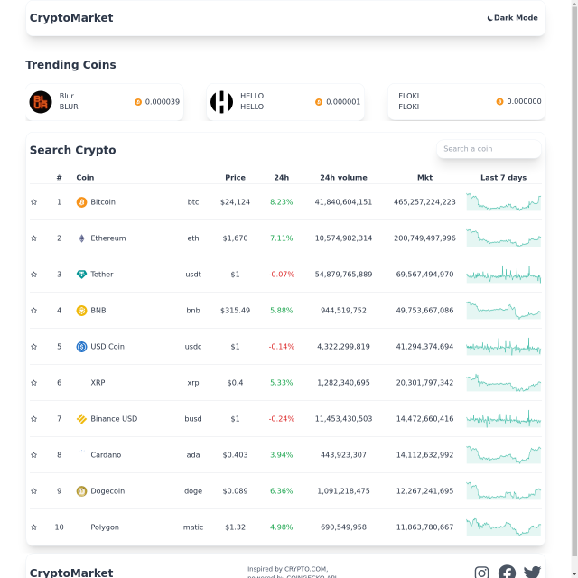

# Cryptomartket

Live https://cryptomarket-project.netlify.app/
Crytpcurrency tracker using the CoinGecko API inspired by the crypto.com/price display.

- **Framework**: [React](https://reactjs.org/)
- **Styling**: [Tailwind CSS](https://tailwindcss.com/)
- **HTTP cache invalidation**: [SWR](https://swr.vercel.app/)
- **Slider**: [Swiperjs](https://swiperjs.com/)
- **API**: [CoinGecko](https://www.coingecko.com/en/api/documentation)

## Proyect overview

- `components/*` - Various components used throughout the site.
- `Hooks/*` - Custom hooks used for dark mode and save preferences to local storage.
- `Hooks/UseRequest` - Swr custom hook data fetch and cache .

- `routes/Coinpage` - Indivdual coin information
- `index.js` - SWR global wrapper and fetcher with interval of 10 minutes .

## To Do:

- Add unit and e2e tests with Cypress
- Add account feature with Expressjs and Mongodb backend
- Add favorite coin feature
